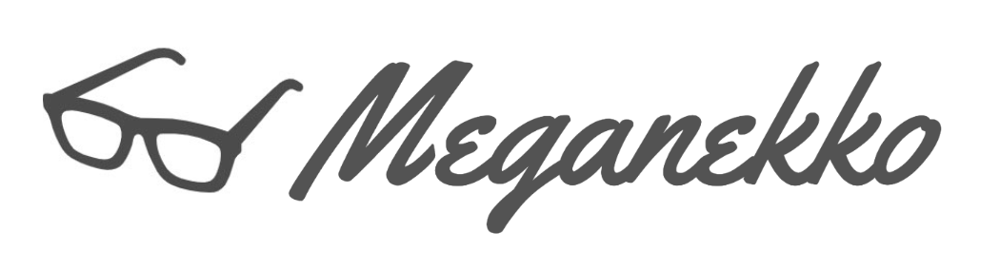
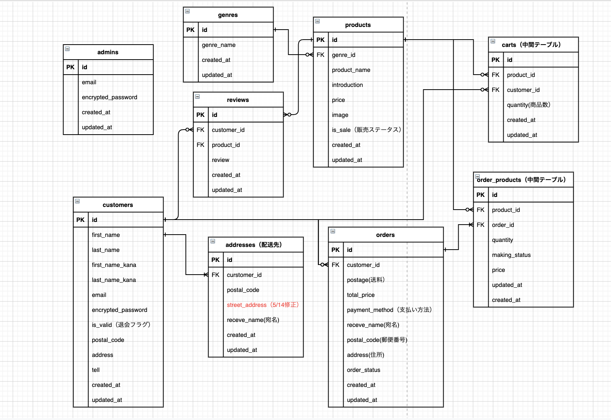
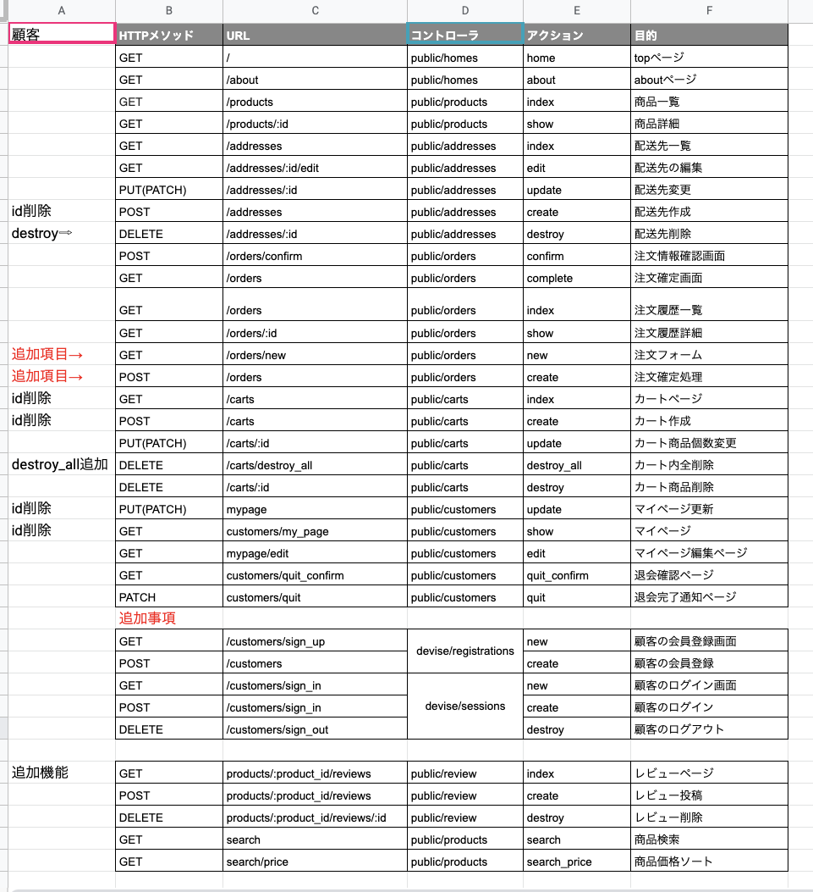

# Nagano_Cake ECサイト
 
DMM WebCamp チーム開発課題

 
# 設計
 
 
# ER図

 
# アプリケーション詳細設計
 
 ・会員側

　・管理者側

 
# 開発環境
 
Ruby on Rails 5.2.5
Ruby 2.6.3
 
 
# チーム名
 
めがねっこ
 
# 開発者
 
・ちゃんもり
・かすみん
・くぼちゃん
・こっしー
 
# 開発期間
2020/5/12/から2020/5/31まで
 
